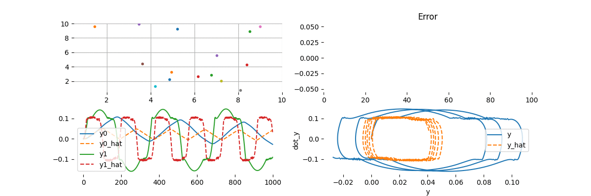

# PSO Method for WhiteBox Identification System

## Overview
This repository contains the source code of WhiteBox Identification System


## USAGE

```bash
# make install 
```
next 

```bash
$(venv)$ python3 nonlinear_function.py
```

### Example
A Nonlinear model is described below:

$`\dot{x}_0 = x_1`$

$`\dot{x}_1 = -2 \omega_n \zeta \delta(x_1)x_1 - \omega_n^2 x_0 + A_1\sin(\omega t)`$

where: 

|symbol| description| value|
|---|---|---|
|$`c`$ ||unknown value|
|$`k_s`$| |unknown value|
|$`m`$ |mass|1Kg|
|$`\omega_n=\sqrt{\frac{k_s}{m}}`$ ||unknown value|
|$`\zeta`$||unknown value|
|$`\omega`$ |Angular Frequency|unknown value|
|$`A_1`$ | Force Gain|4|

and


$`\delta(x_1)=\begin{cases}  5.0, & \text{if $|x_1|<v_1$}.\\   0.5, & \text{otherwise}.\end{cases}`$

Dynamic Model is define by:

```python
class EqSystem(Model):
    def __init__(self, params=None):
        super(EqSystem, self).__init__(params)
        self._params = params

    def model(self, t, x):
        def delta(vel):
            if abs(vel) > 0.1:
                d = 5.0
            else:
                d = 0.5
            return d
        k = self.unknown_const
        ks   = k[0]
        c    = k[1]
        w    = k[2]
        m    = 1
        wn   = np.sqrt(k[0]/m)
        zeta = k[1]/(2*m*wn)
        dx = torch.zeros(len(self.x0),)
        dx[0] = x[1]
        dx[1] = -2 * zeta * wn * delta(x[1])*x[1] - wn ** 2 * x[0] + 4*np.sin(2*np.pi*k[2]*t)
        return dx
```

## Results



# Bugs & Feature Requests
Please report bugs and request features using the [issues](https://gitlab.com/limajj_articles/core/wbident/-/issues)
